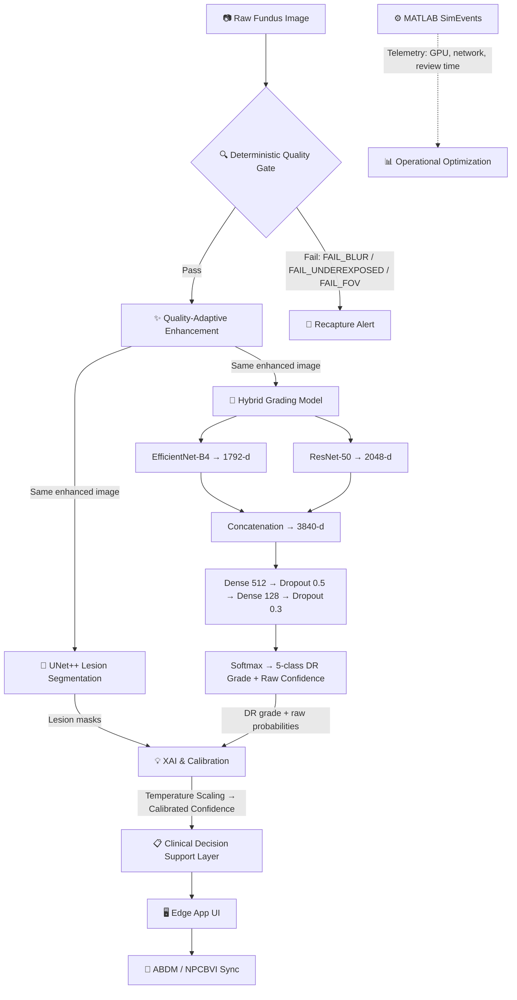

# NETRA — Master Implementation Plan

**Problem Statement ID:** SIH26038
**Problem Statement Title:** Explainable AI for Diabetic Retinopathy Screening in Rural India
**Theme:** MedTech / BioTech / HealthTech &nbsp;|&nbsp; **PS Category:** Software
**Team:** ByteCrew (Team ID 24)

---

## 1. Core Objective

NETRA is a quality-aware, explainable AI Clinical Decision Support System (CDSS) for Diabetic Retinopathy (DR) screening in resource-constrained rural clinics. It combines a **parallel dual-track deep learning engine** (lesion segmentation ∥ severity grading) with **MATLAB Simulink operational simulation**, so the system is validated not just on diagnostic accuracy but on whether the screening workflow can actually scale in a real rural Primary Health Centre (PHC).

**The problem it solves:**
- Rural India has widespread DR risk but very few ophthalmologists.
- Existing AI tools diagnose without explaining *why*, and without checking image quality first.

**Our solution:** Grade DR severity (ICDR 0–4) from fundus images through a quality-gated, explainable pipeline — validated with a SimEvents simulation to confirm the workflow scales.

---

## 2. System Architecture & Data Flow



```
Raw Fundus Image
   → Deterministic Quality Gate (Blur / Exposure / FOV)
   → [Pass] → Quality-Adaptive Enhancement (Green-Channel CLAHE, denoising, ROI crop)
        Enhancement strength adapts based on quality scores (low/medium/high profiles)
   → Parallel Dual-Track AI (same enhanced image feeds both simultaneously):
        Track A — UNet++ Lesion Segmentation (microaneurysms, hemorrhages, exudates)
        Track B — Hybrid Grading Model:
             Branch 1: EfficientNet-B4 → 1792-d feature vector
             Branch 2: ResNet-50 → 2048-d feature vector
             Fusion: Concatenation → 3840-d combined vector
             Classifier: Dense(512, ReLU) → Dropout(0.5) → Dense(128, ReLU) → Dropout(0.3) → Softmax(5)
             Output: DR severity (Level 0–4) + raw confidence
   → XAI & Calibration:
        Grad-CAM / Score-CAM / SHAP for prediction explanations
        IoU between Grad-CAM attention and UNet++ lesion masks (sanity check)
        Temperature Scaling → recalibrated confidence (final reported score)
   → Clinical Decision Support Layer (severity + lesion maps + calibrated confidence → report)
   → Edge App UI (React/Electron, offline-first) + ABDM/NPCBVI sync
```

The pipeline uses **parallel dual-track processing**: both UNet++ (segmentation) and the Hybrid Model (grading) receive the **same enhanced image** simultaneously and run concurrently. Their outputs merge at the XAI & Calibration layer, which combines lesion locations from UNet++ with the grading decision from the Hybrid Model. The final reported confidence uses **post-temperature-scaling recalibrated probabilities**, not raw softmax. Enhancement is **quality-adaptive** — parameters dynamically adjust based on quality gate scores. A parallel **Operational Optimization track** collects telemetry and feeds a MATLAB SimEvents model to prove the pipeline scales.

---

## 3. Phase-by-Phase Execution Roadmap

### Phase 0 — Scope Lock & Data Ingestion

**Purpose:** Freeze architecture, set up infrastructure, prepare datasets.

- Freeze the parallel dual-track architecture (UNet++ Segmentation ∥ Hybrid DL Grading); set repo structure and `.gitignore` rules.
- Register for the MathWorks SIH license track (needed for the Simulink component).
- Establish **patient-isolated** dataset splits (70/15/15) across EyePACS, APTOS 2019, IDRiD, FGADR, and DDR — patient-level, not image-level, to avoid data leakage.

#### Files
##### [NEW] `configs/default_config.yaml`
- Master configuration: dataset paths, split ratios, model hyperparameters, quality thresholds

##### [NEW] `src/data/dataset_splitter.py`
- Patient-level dataset splitting (70/15/15)
- Cross-dataset integration (EyePACS, APTOS, IDRiD, FGADR, DDR)
- Data leakage prevention validation

##### [NEW] `requirements.txt`
- All Python dependencies pinned to versions

##### [NEW] `README.md`
- Project overview, setup instructions, architecture summary

---

### Phase 1 — Preprocessing: Quality Gate

**Purpose:** Implement deterministic quality checks that flag bad captures for recapture instead of forcing a diagnosis on a low-quality image.

#### Components
- **Laplacian Blur-Variance Check** — Focus/sharpness detection
- **Histogram/Intensity Exposure Check** — Over/under-exposure detection
- **FOV Mask Coverage Check** — Field of view completeness
- **Recapture Alerts** — Actionable feedback codes: `FAIL_BLUR`, `FAIL_UNDEREXPOSED`, `FAIL_FOV`

#### Validation Strategy
Validate against **synthetically degraded images** (blurred / over- and under-exposed copies of good images) to confirm the gate actually catches failure modes.

#### Files
##### [NEW] `src/quality/__init__.py`
- Package initialization

##### [NEW] `src/quality/quality_gate.py`
- Laplacian variance blur detection
- Histogram & mean intensity exposure check
- FOV mask coverage via Hough Circle Transform / Otsu thresholding
- Binary pass/fail decision with per-metric scoring
- Returns structured result: `{pass: bool, scores: {blur, exposure, fov}, fail_codes: [...]}`

##### [NEW] `src/quality/recapture_alert.py`
- Maps fail codes to actionable recapture instructions
  - `FAIL_BLUR` → "Hold camera steady and refocus"
  - `FAIL_UNDEREXPOSED` → "Increase illumination or flash intensity"
  - `FAIL_OVEREXPOSED` → "Reduce illumination"
  - `FAIL_FOV` → "Recenter the retina in the frame"
- Structured JSON output with reason codes + human-readable messages
- Rejection event logging (timestamp, image ID, scores, fail codes)

##### [NEW] `src/quality/synthetic_degradation.py`
- Synthetic blur generator (Gaussian blur at varying kernel sizes)
- Brightness manipulation (gamma correction for over/under exposure)
- FOV cropping simulator
- Used for quality gate validation testing

##### [NEW] `tests/test_quality_gate.py`
- Sharp image passes quality gate
- Synthetically blurred image triggers `FAIL_BLUR`
- Dark image triggers `FAIL_UNDEREXPOSED`
- Overexposed image triggers `FAIL_OVEREXPOSED`
- Cropped FOV image triggers `FAIL_FOV`
- Multi-failure scenario returns all applicable codes
- Borderline threshold edge cases

---

### Phase 2 — Preprocessing: Quality-Adaptive Enhancement

**Purpose:** Transform quality-approved fundus images into standardized, contrast-enhanced inputs optimized for downstream AI models. Enhancement strength dynamically adapts based on quality gate scores.

#### Components
- **Otsu-threshold ROI Cropping** — Isolate the fundus disc from the black background
- **Green-Channel CLAHE** — Contrast enhancement on the green channel (carries the most vascular/lesion contrast in fundus photography)
- **Non-Local Means Denoising** — Noise reduction while preserving edges
- **Standardization** — Resize to 512×512 arrays for model input
- **Quality-Adaptive Parameter Selection** — Dynamic enhancement strength based on quality scores

#### Quality-Adaptive Strategy
- **If quality score ≥ threshold (good image):** Use standard enhancement parameters
- **If quality score < threshold but above rejection (borderline image):** Apply **stronger enhancement** (higher CLAHE clip limit, stronger denoising) + **dynamic confidence adjustment** (lower the confidence threshold for auto-approval downstream)
- Enhancement parameter profiles: `low` / `medium` / `high` intensity, selected based on quality scores

#### Files
##### [NEW] `src/quality/enhancement.py`
- Otsu-threshold ROI cropping (binary mask → bounding box → crop)
- Green channel extraction
- CLAHE with configurable clip limit and tile grid size (applied to green channel)
- Multi-channel CLAHE variant (LAB color space)
- Non-Local Means (NLM) denoising
- Resize and normalize to 512×512
- **Quality-adaptive parameter selector:** maps quality scores → enhancement profile (low/medium/high)
- Full enhancement pipeline orchestrator: ROI crop → Green CLAHE → Denoise → Standardize
- Before/after quality metric comparison

##### [NEW] `tests/test_enhancement.py`
- CLAHE increases histogram spread (contrast improvement)
- NLM denoising reduces noise (SNR improvement)
- ROI crop correctly isolates fundus disc
- Output shape is exactly 512×512
- Enhancement preserves clinical features (no artifacts introduced)
- Full pipeline integration test

---

### Phase 3 — Parallel Dual-Track AI & Explainability

**Purpose:** Implement the parallel dual-track AI pipeline (segmentation ∥ grading) and interpretability layer. Both tracks receive the **same enhanced image** simultaneously and are **trained independently**. Their outputs merge at the XAI & Calibration layer.

#### Track A — Lesion Segmentation (UNet++)

**Model:** UNet++
**Input:** Enhanced fundus image (512×512×3) — same image that Track B receives
**Training Data:** IDRiD and FGADR — chosen specifically because both provide **pixel-level lesion masks** (microaneurysms, hemorrhages, exudates), which a grading-only dataset like APTOS cannot supply.
**Validation:** DDR dataset for segmentation performance benchmarking.
**Target:** Usable IoU against ground-truth lesion masks, cross-checked against Grad-CAM attention maps for consistency.
**Training:** Independent from Track B. Loss: pixel-wise Dice Loss + BCE. No joint training with the hybrid model (incompatible loss functions; would require triple-annotated data).
**Output:** Multi-class lesion masks used for:
- **XAI sanity check:** IoU between Grad-CAM attention maps and lesion masks to verify the grading model "looks at" actual lesions
- **Clinical reports:** Lesion overlay maps in the generated PDF reports

> **Note:** UNet++ handles **lesion segmentation only** (microaneurysms, hemorrhages, exudates). Optic disc, fovea, and vessel segmentation are **separate, simpler pipelines** (e.g., thresholding or pre-trained U-Net for vessels) handled in the quality assessment module. Neovascularization is **not segmented** by UNet++ — it is detected implicitly by the hybrid grading model through classification (Level 4 / PDR).

##### Files
###### [NEW] `src/segmentation/__init__.py`
- Package initialization

###### [NEW] `src/segmentation/unetpp.py`
- UNet++ architecture implementation
- Encoder: pretrained backbone (ResNet-34 or EfficientNet)
- Dense skip connections (nested decoder paths)
- Multi-scale output with deep supervision

###### [NEW] `src/segmentation/lesion_segmentor.py`
- Multi-class segmentation head (microaneurysms, hemorrhages, exudates)
- Per-class and aggregate IoU computation
- Inference pipeline: image → preprocessed → UNet++ → lesion masks

###### [NEW] `src/segmentation/train_segmentation.py`
- Training loop for UNet++ on IDRiD + FGADR
- Loss: Dice Loss + Binary Cross-Entropy
- Data augmentation: rotation, flip, color jitter, elastic deform
- IoU / Dice metric tracking per lesion class

###### [NEW] `tests/test_segmentation.py`
- Forward pass shape verification
- IoU computation correctness
- Per-class segmentation accuracy on test split

---

#### Track B — DR Severity Grading (Hybrid DL)

**Model:** EfficientNet-B4 + ResNet-50 dual-branch fusion
**Input:** Enhanced fundus image (512×512×3) — same image that Track A receives. The hybrid model does **not** use UNet++ output at any stage.
**Training:** Independent from Track A. Trained separately with a two-stage strategy:
- **Pretrain on APTOS 2019** — teaches general eye anatomy and broad DR feature representations from a larger, more heterogeneous image pool
- **Fine-tune on IDRiD** — adapts the model to India-specific population traits and local fundus camera conditions, which is where domain shift tends to hurt generalization the most
**Targets:** QWK ≥ 0.88, Referable-DR Sensitivity ≥ 90%

> **Neovascularization:** Detected implicitly by the hybrid model through classification (Level 4 / PDR), **not** segmented pixel-wise. Neovascularization appears as fine branching structures that are extremely difficult to annotate pixel-wise and rare in datasets.

##### Hybrid Model Architecture

```
Enhanced Image (512×512×3)
    ├── Branch 1: EfficientNet-B4 (pretrained ImageNet)
    │   └── Extracts fine-grained local features (microaneurysms, small exudates)
    │   └── Output: 1792-dimensional feature vector
    │
    ├── Branch 2: ResNet-50 (pretrained ImageNet)
    │   └── Extracts complementary features (larger patterns, textures, structural relationships)
    │   └── Output: 2048-dimensional feature vector
    │
    └── Feature Fusion:
        └── Concatenation → 3840-dimensional combined vector
        └── Dense Layer (512 units, ReLU activation)
        └── Dropout (0.5)
        └── Dense Layer (128 units, ReLU activation)
        └── Dropout (0.3)
        └── Output Layer (5 units, Softmax activation)

Output: Probabilities for 5 DR levels → highest probability = final prediction + confidence score (e.g., 94.7%)
```

##### DR Severity Scale (ICDR)
| Level | Grade | Description |
|-------|-------|-------------|
| 0 | No DR | No visible retinopathy |
| 1 | Mild NPDR | Microaneurysms only |
| 2 | Moderate NPDR | More than just microaneurysms |
| 3 | Severe NPDR | Extensive hemorrhages, venous beading |
| 4 | PDR | Neovascularization, vitreous/preretinal hemorrhage |

##### Files
###### [NEW] `src/models/__init__.py`
- Package initialization

###### [NEW] `src/models/efficientnet_backbone.py`
- EfficientNet-B4 feature extractor (pretrained on ImageNet)
- Global average pooling → **1792-dimensional feature vector** output
- Fine-grained local feature extraction (microaneurysms, small exudates)

###### [NEW] `src/models/resnet_backbone.py`
- ResNet-50 complementary feature extractor (pretrained on ImageNet)
- Global average pooling → **2048-dimensional feature vector** output
- Complementary feature extraction (larger patterns, textures, structural relationships)

###### [NEW] `src/models/feature_fusion.py`
- Concatenation of 1792-d + 2048-d → **3840-dimensional** combined vector
- Classification head:
  - Dense(512, ReLU) → Dropout(0.5)
  - Dense(128, ReLU) → Dropout(0.3)
  - Output(5, Softmax)

###### [NEW] `src/models/hybrid_model.py`
- End-to-end model: enhanced image → [EfficientNet-B4 ∥ ResNet-50] → Concat(3840) → Dense(512) → Dense(128) → Softmax(5)
- Both branches process the same enhanced image simultaneously
- Outputs: 5-class probability distribution + confidence score (max probability)
- Support for frozen/unfrozen backbone fine-tuning

###### [NEW] `src/training/trainer.py`
- Training loop with two-stage strategy:
  1. Pretrain on APTOS 2019
  2. Fine-tune on IDRiD
- Loss: Cross-Entropy + Focal Loss option
- Optimizer: AdamW with cosine annealing LR schedule
- Early stopping on validation QWK
- Metrics: Accuracy, QWK, AUC, Referable-DR Sensitivity
- Checkpoint saving and best-model tracking

###### [NEW] `tests/test_models.py`
- Model architecture validation
- EfficientNet-B4 outputs 1792-d vector
- ResNet-50 outputs 2048-d vector
- Concatenation produces 3840-d vector
- Forward pass shape verification (512×512×3 image → 5-class probability output)
- Dense(512) → Dense(128) → Softmax(5) classifier head test
- Confidence score computation test
- Two-stage training pipeline smoke test (APTOS pretrain → IDRiD fine-tune)

---

#### Interpretability & Calibration

**Purpose:** Explain *why* the model made its prediction, and ensure confidence scores are trustworthy. This module receives outputs from **both** Track A (lesion masks) and Track B (DR grade + raw probabilities) and combines them.

- **Grad-CAM, Score-CAM, SHAP** for prediction explanations
- **IoU between Grad-CAM attention and UNet++ lesion masks** as a sanity check that the model is "looking at" the right structures
- **Temperature Scaling** to minimize Expected Calibration Error (ECE): `Z_scaled = Z / T`, where T is learned on validation data by minimizing negative log-likelihood
- **Final reported confidence = post-temperature-scaling recalibrated probability** (not raw softmax)

##### Files
###### [NEW] `src/explainability/__init__.py`
- Package initialization

###### [NEW] `src/explainability/grad_cam.py`
- Gradient-weighted class activation mapping
- Layer selection for target convolutional layer
- Heatmap overlay generation on original fundus image

###### [NEW] `src/explainability/score_cam.py`
- Score-CAM implementation (gradient-free alternative)
- Channel-wise activation scoring
- Class-discriminative localization maps

###### [NEW] `src/explainability/shap_explainer.py`
- SHAP (SHapley Additive exPlanations) integration
- Feature importance computation
- SHAP summary and force plots

###### [NEW] `src/explainability/confidence_calibration.py`
- Temperature Scaling implementation: `Z_scaled = Z / T`
- T learned on validation data by minimizing negative log-likelihood
- ECE (Expected Calibration Error) computation
- **Output: calibrated probability (this is the final reported confidence, not raw softmax)**
- Reliability diagram generation
- Optional: ensemble of calibration methods (Platt scaling, isotonic regression, histogram binning)

###### [NEW] `src/explainability/attention_lesion_iou.py`
- Compute IoU between Grad-CAM attention maps and UNet++ segmentation masks
- Sanity check: is the grading model looking at actual lesions?
- Per-class attention-lesion alignment scores

###### [NEW] `tests/test_explainability.py`
- Grad-CAM output shape and value range tests
- Score-CAM produces valid heatmaps
- SHAP value consistency
- Temperature scaling reduces ECE
- Attention-lesion IoU computation correctness

---

### Phase 4 — MATLAB Simulink Operational Track

**Purpose:** Prove the pipeline doesn't just diagnose well — it scales in a real rural PHC setting. Also the basis for competing in the **MathWorks Special Award** category.

#### Components
- **SimEvents Discrete-Event Model** — Patient arrival → camera capture station → AI inference queue → tele-review backlog for flagged/uncertain cases
- **Telemetry Integration** — Feed real inference time, review time, GPU utilization into the simulation
- **Doctor Workload Reduction** — Target: 80%+ efficiency gain

#### Files
##### [NEW] `simulink/dr_system_simulation.slx`
- Main SimEvents model: patient flow through rural PHC
- Subsystems: arrival generator, capture station, inference queue, review queue
- Configurable parameters: arrival rate, inference time, review capacity

##### [NEW] `simulink/resource_optimizer.m`
- Resource allocation optimization
- Bottleneck identification
- Throughput maximization under constraints

##### [NEW] `simulink/throughput_analysis.m`
- End-to-end throughput measurement
- Utilization metrics per station
- Doctor workload reduction calculation

##### [NEW] `simulink/telemetry_feeder.py`
- Python script to export real telemetry data (inference times, GPU load, review durations) into MATLAB-readable format
- Keeps simulation grounded in actual system performance

---

### Phase 5 — Deployment

**Purpose:** Package the system for offline-first edge deployment in rural clinics.

#### Components
- **ONNX INT8 Quantization** — Model optimization for edge inference
- **React/Electron Desktop App** — Offline-first UI
- **SQLite Local Logging** — Local data persistence
- **ABDM/NPCBVI Integration** — National health record compatibility
- **Auto-generated PDF Reports** — Severity + lesion heatmap + confidence + recommendation

#### Files
##### [NEW] `src/deployment/onnx_export.py`
- PyTorch → ONNX conversion for both UNet++ and Hybrid Grading model
- INT8 quantization with calibration dataset
- Inference speed benchmarking (latency per image)

##### [NEW] `src/deployment/inference_engine.py`
- ONNX Runtime inference wrapper
- Batch inference support
- GPU/CPU fallback logic

##### [NEW] `src/reporting/report_generator.py`
- Auto-generated PDF diagnostic report
- Contents: severity grade, lesion heatmap overlay, Grad-CAM attention map, confidence score, clinical recommendation
- Structured layout for ophthalmologist review

##### [NEW] `src/reporting/clinical_decision_support.py`
- Clinical Decision Support Layer
- Aggregates: severity grade + lesion maps + confidence → structured clinical output
- Referral logic: urgent vs. routine follow-up based on severity

##### [NEW] `app/` (React/Electron)
- Offline-first desktop application
- Patient registration, image capture trigger, results display
- SQLite local storage
- ABDM/NPCBVI sync when connectivity available

---

### Phase 6 — Clinical Validation

**Purpose:** Validate generalization and secure clinical endorsement.

- External validation on **Messidor-2** (a dataset the models were never trained/tuned on) to test true generalization
- Secure a signed endorsement / review letter from a practicing ophthalmologist

#### Files
##### [NEW] `src/validation/external_validation.py`
- Evaluation pipeline on Messidor-2
- Compute QWK, Sensitivity, Specificity, AUC on unseen data
- Generate comparison report: IDRiD test set vs. Messidor-2

---

## 4. Why This Dataset Strategy (Feasibility Notes)

| Challenge | Mitigation |
|---|---|
| Limited Indian annotated data (IDRiD is small) | Three-tier strategy: APTOS (pretrain, scale) → IDRiD (fine-tune, local relevance) → real field validation |
| Rural fundus images are noisy (blur, glare, low light) | Quality Gate flags bad captures for recapture; quality-adaptive enhancement dynamically adjusts parameters for borderline images |
| Microaneurysms span only a few pixels | High-resolution patch-level analysis in the segmentation track |
| Domain shift across cameras/populations | Patient-level splits + multi-camera testing; fine-tuning step specifically targets this |
| Incompatible loss functions (segmentation vs. classification) | Independent training pipelines — no joint training required |
| Neovascularization hard to annotate pixel-wise | Detected implicitly by hybrid model classification, not segmented |

### Dataset Roles

| Dataset | Role |
|---|---|
| **APTOS** | Classification pretraining (large, balanced, mask-free) |
| **IDRiD** | Classification fine-tuning + Segmentation training for UNet++ (provides both grades and pixel-level lesion masks) |
| **FGADR** | Additional segmentation training data for UNet++ (lesion masks) |
| **DDR** | Validation dataset for UNet++ segmentation performance |
| **EyePACS** | External validation to test generalization (note: APTOS is derived from EyePACS) |

Every core module (CNN grading, CLAHE enhancement, Grad-CAM explainability, Simulink capacity modeling) is built on techniques already validated in deployed research and real Indian screening programs — this is a feasibility strength to lean on in review.

---

## 5. Tech Stack

- **Modeling:** PyTorch (UNet++, EfficientNet-B4, ResNet-50), Grad-CAM/Score-CAM/SHAP libraries
- **Deployment:** ONNX Runtime (INT8 quantization), React + Electron
- **Data/Storage:** SQLite (local), ABDM/NPCBVI field schema
- **Simulation:** MATLAB Simulink + SimEvents
- **Infra:** Git/GitHub for version control, patient-isolated dataset pipeline

---

## 6. Project Structure

```
netra/
├── src/
│   ├── data/
│   │   └── dataset_splitter.py
│   ├── quality/
│   │   ├── __init__.py
│   │   ├── quality_gate.py
│   │   ├── recapture_alert.py
│   │   ├── enhancement.py
│   │   └── synthetic_degradation.py
│   ├── segmentation/
│   │   ├── __init__.py
│   │   ├── unetpp.py
│   │   ├── lesion_segmentor.py
│   │   └── train_segmentation.py
│   ├── models/
│   │   ├── __init__.py
│   │   ├── efficientnet_backbone.py
│   │   ├── resnet_backbone.py
│   │   ├── feature_fusion.py
│   │   └── hybrid_model.py
│   ├── training/
│   │   └── trainer.py
│   ├── explainability/
│   │   ├── __init__.py
│   │   ├── grad_cam.py
│   │   ├── score_cam.py
│   │   ├── shap_explainer.py
│   │   ├── confidence_calibration.py
│   │   └── attention_lesion_iou.py
│   ├── reporting/
│   │   ├── report_generator.py
│   │   └── clinical_decision_support.py
│   ├── deployment/
│   │   ├── onnx_export.py
│   │   └── inference_engine.py
│   └── validation/
│       └── external_validation.py
├── simulink/
│   ├── dr_system_simulation.slx
│   ├── resource_optimizer.m
│   ├── throughput_analysis.m
│   └── telemetry_feeder.py
├── app/                          # React/Electron edge app
├── tests/
│   ├── test_quality_gate.py
│   ├── test_enhancement.py
│   ├── test_segmentation.py
│   ├── test_models.py
│   └── test_explainability.py
├── configs/
│   └── default_config.yaml
├── data/
│   ├── sample_images/
│   └── datasets/
├── requirements.txt
└── README.md
```

---

## 7. Team Work Allocation

> Fill in actual names — structure below follows the four functional tracks.

| Track | Lead | Key Deliverables |
|---|---|---|
| Quality Gate | *[Name]* | `quality_gate.py`, synthetic degradation validation, recapture-alert rules |
| Preprocessing | *[Name]* | `enhancement.py`, ROI cropping, Green-channel CLAHE, standardized 512×512 arrays |
| AI Core (Segmentation + Grading) | *[Name(s)]* | UNet++ segmentation, EfficientNet-B4/ResNet-50 grading, PyTorch training pipelines, Grad-CAM/SHAP integration |
| Simulation & UI | *[Name]* | MATLAB SimEvents clinic model, React/Electron edge app, ABDM integration, PDF report generation |

---

## 8. Target Metrics Summary

| Metric | Target |
|---|---|
| QWK (severity grading) | ≥ 0.88 |
| Referable DR Sensitivity | ≥ 90% |
| Doctor workload reduction (Simulink model) | ≥ 80% |
| Screening time per patient | < 2 minutes |
| Expected Calibration Error (ECE) | Minimized via temperature scaling |

---

## 9. Verification Plan

### Automated Tests
```bash
# Run all unit tests
pytest tests/ -v

# Quality gate tests (Phase 1)
pytest tests/test_quality_gate.py -v

# Enhancement tests (Phase 2)
pytest tests/test_enhancement.py -v

# Segmentation tests (Phase 3, Track A)
pytest tests/test_segmentation.py -v

# Grading model tests (Phase 3, Track B)
pytest tests/test_models.py -v

# Explainability tests (Phase 3, XAI)
pytest tests/test_explainability.py -v
```

### Manual Verification
- Quality gate validation with synthetically degraded images
- CLAHE enhancement produces visible contrast improvement on green channel
- UNet++ lesion masks align with ground truth on IDRiD test set
- Hybrid model QWK ≥ 0.88 on validation split
- Grad-CAM heatmaps highlight actual lesions (IoU with UNet++ masks)
- Temperature scaling reduces ECE on calibration set
- External validation on Messidor-2 for generalization
- Ophthalmologist review of sample automated PDF reports
- SimEvents model produces realistic throughput estimates with real telemetry

---

## 10. Key References

- Porwal et al. (2018) — IDRiD dataset, IEEE ISBI-2018 Challenge.
- Ashtagi et al. (2026) — UNet++ and Explainable AI for Early Detection of DR from Fundus Images.
- Rawat & Kumar (2026) — Hybrid Deep Learning Framework with Explainable AI for DR Grading.
- Dey et al. — AI-Driven DR Screening: Multicentric Validation of AIDRSS in India.
- APTOS 2019 Blindness Detection (Kaggle).
- RSSDI & VRSI (2023/2024) — DR screening guidelines for physicians in India.

*(Full reference list is on the PPT's Research & References slide — copy in full if needed for report/documentation.)*
