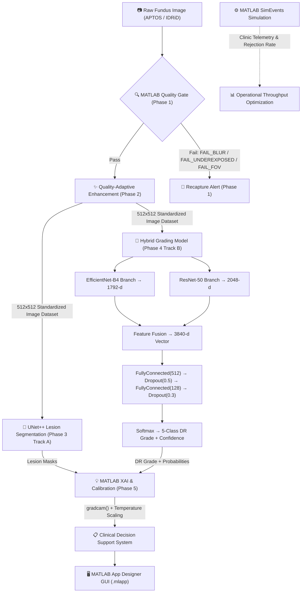

# NETRA — MATLAB Master Implementation Plan

**Problem Statement ID:** SIH26038  
**Problem Statement Title:** Explainable AI for Diabetic Retinopathy Screening in Rural India  
**Theme:** MedTech / BioTech / HealthTech &nbsp;|&nbsp; **PS Category:** Software  
**Team:** ByteCrew (Team ID 24)  

---

## 1. Core Objective

NETRA is a quality-aware, explainable AI Clinical Decision Support System (CDSS) for Diabetic Retinopathy (DR) screening in resource-constrained rural clinics. Built as a **100% end-to-end MATLAB pipeline**, it combines a **parallel dual-track deep learning engine** (lesion segmentation ∥ severity grading) with **MATLAB Simulink operational simulation**, ensuring the system is validated not just on diagnostic precision but on whether the screening workflow can scale in a real rural Primary Health Centre (PHC).

**The problem it solves:**
- Rural India has widespread DR risk but very few ophthalmologists.
- Existing AI tools diagnose without explaining *why*, and without evaluating image quality first.

**Our solution:** Grade DR severity (ICDR 0–4) from fundus images through a quality-gated, explainable MATLAB pipeline — validated with a SimEvents discrete-event simulation to confirm operational viability.

---

## 2. System Architecture & Data Flow (MATLAB Pipeline)



```
Raw Fundus Image (APTOS / IDRiD)
   → MATLAB Deterministic Quality Gate (check_focus.m / check_exposure.m / check_fov.m)
   → [Pass] → MATLAB Quality-Adaptive Enhancement (crop_fundus_roi.m, apply_clahe.m, apply_nlm_denoising.m)
        Enhancement strength adapts based on composite score (low / medium / high / borderline profiles)
   → Enhanced 512x512 Dataset feeds Parallel Dual-Track MATLAB AI:
        Track A — MATLAB UNet++ Lesion Segmentation (microaneurysms, hemorrhages, exudates)
        Track B — MATLAB Hybrid Deep Learning Classifier:
             Branch 1: EfficientNet-B4 → 1792-d feature vector
             Branch 2: ResNet-50 → 2048-d feature vector
             Fusion: Feature Concatenation → 3840-d combined vector
             Classifier Head: FullyConnected(512) → Dropout(0.5) → FullyConnected(128) → Dropout(0.3) → Softmax(5)
             Output: DR severity (Level 0–4) + raw confidence
   → MATLAB XAI & Calibration:
        Grad-CAM (via MATLAB gradcam() function) for prediction attention heatmaps
        IoU computation between Grad-CAM attention and UNet++ lesion masks
        Temperature Scaling → recalibrated confidence score
   → Clinical Decision Support Layer (Severity Grade + Lesion Overlay + Calibrated Confidence → PDF Report)
   → MATLAB App Designer GUI (NETRA_App.mlapp for live interactive clinical triage)
   → SimEvents Operational Model (Clinic throughput, doctor workload reduction simulation)
```

---

## 3. Dataset Preprocessing & Two-Stage Training Flow

> [!IMPORTANT]
> **Crucial Data Flow Rules for Team Members:**
> All raw dataset images (APTOS 2019, IDRiD, FGADR, DDR) **MUST** pass through Phase 1 (Quality Gate) and Phase 2 (Adaptive Enhancement) before being used for training or fine-tuning models.

```
[Raw APTOS 2019 Images] ──> Phase 1 Quality Gate ──> Phase 2 Enhancement ──> [Enhanced APTOS 512x512] ──> STAGE 1 PRE-TRAINING (Hybrid Model)
                                                                                                               │
[Raw IDRiD Images]      ──> Phase 1 Quality Gate ──> Phase 2 Enhancement ──> [Enhanced IDRiD 512x512] ──> STAGE 2 FINE-TUNING (Hybrid Model) & UNet++ Training
```

1. **Stage 1: Pre-training on APTOS 2019**
   - **Step A**: Run Phase 1 Quality Gate on raw APTOS 2019 images. Reject ungradeable images.
   - **Step B**: Run Phase 2 Enhancement (`enhance_fundus.m`) to generate standardized 512×512 enhanced APTOS images.
   - **Step C**: Pre-train the Hybrid Model (ResNet-50 + EfficientNet-B4) on the enhanced APTOS dataset to learn general anatomical structures and broad DR severity features.

2. **Stage 2: Fine-Tuning on IDRiD & Lesion Training**
   - **Step A**: Run Phase 1 & Phase 2 on the India-specific IDRiD dataset to produce enhanced 512×512 IDRiD images.
   - **Step B**: Fine-tune the pre-trained Hybrid Model on enhanced IDRiD images to adapt to Indian population traits and local camera noise.
   - **Step C**: Train MATLAB UNet++ on enhanced IDRiD & FGADR pixel-level lesion masks (microaneurysms, hemorrhages, exudates).

---

## 4. Phase-by-Phase Execution Roadmap

### Phase 0 — Scope Lock & MATLAB Infrastructure Setup

**Purpose:** Freeze architecture, configure MATLAB toolboxes, prepare datasets.

- Freeze the 100% MATLAB pipeline architecture.
- Verify MATLAB R2026a license track with required toolboxes:
  - Image Processing Toolbox (`adapthisteq`, `imnlmfilt`, `imbinarize`, `regionprops`)
  - Deep Learning Toolbox (`trainNetwork`, `semanticseg`, `gradcam`, `importONNXNetwork`)
  - Statistics and Machine Learning Toolbox (`var`, `median`, `entropy`)
  - Simulink & SimEvents (Discrete-event clinic workflow simulation)
- Establish **patient-isolated** dataset splits (70/15/15) across EyePACS, APTOS 2019, IDRiD, FGADR, and DDR.

#### Files
- `matlab/config/load_config.m` — Reads `configs/default_config.yaml` into a nested MATLAB struct. [COMPLETED ✅]
- `configs/default_config.yaml` — Master configuration file for quality thresholds, enhancement profiles, and model parameters.

---

### Phase 1 — Preprocessing: Quality Gate (MATLAB) — [COMPLETED ✅]

**Purpose:** Implement deterministic quality checks in MATLAB that flag inadequate fundus captures for recapture before running AI inference.

#### Components
- **Focus Check (`check_focus.m`)** — Laplacian variance + Tenengrad gradient magnitude sharpness metrics.
- **Exposure Check (`check_exposure.m`)** — FOV mask mean brightness + Shannon Entropy calculation.
- **FOV Coverage Check (`check_fov.m`)** — Otsu thresholding + connected component analysis for completeness & centering offset.
- **Recapture Alerts (`recapture_alert.m`)** — Actionable clinical operator feedback (`FAIL_BLUR`, `FAIL_UNDEREXPOSED`, `FAIL_OVEREXPOSED`, `FAIL_FOV_COVERAGE`).
- **Master Orchestrator (`quality_gate.m`)** — Evaluates all Phase 1 checks and generates a structured report.

#### Files
- `matlab/quality/check_focus.m` [COMPLETED ✅]
- `matlab/quality/check_exposure.m` [COMPLETED ✅]
- `matlab/quality/check_fov.m` [COMPLETED ✅]
- `matlab/quality/recapture_alert.m` [COMPLETED ✅]
- `matlab/quality/quality_gate.m` [COMPLETED ✅]
- `matlab/tests/test_quality_gate.m` — Unit test suite for Phase 1. [COMPLETED ✅]

---

### Phase 2 — Preprocessing: Quality-Adaptive Enhancement (MATLAB) — [COMPLETED ✅]

**Purpose:** Transform quality-approved fundus images into standardized 512×512 arrays optimized for downstream MATLAB AI models. Enhancement parameters adapt dynamically based on Phase 1 composite quality scores.

#### Components
- **Fundus ROI Cropping (`crop_fundus_roi.m`)** — Isolates the fundus disc from black borders using Otsu thresholding and bounding box extraction with margin.
- **Green-Channel & LAB CLAHE (`apply_clahe.m`)** — Contrast enhancement on the green channel (vascular/lesion emphasis) or CIE L*a*b* space using `adapthisteq`.
- **Non-Local Means Denoising (`apply_nlm_denoising.m`)** — Edge-preserving smoothing via MATLAB's `imnlmfilt`.
- **Aspect-Ratio Preserving Standardization (`standardize_image.m`)** — Letterbox resize to 512×512 with centered black padding to prevent anatomical distortion.
- **Dynamic Profile Selector (`select_profile.m`)** — Maps composite quality score to `low`, `medium`, `high`, or `borderline` enhancement profiles.
- **Quality Metrics Evaluator (`compute_metrics.m`)** — Evaluates contrast (histogram std), SNR (dB), and focus score before and after enhancement.
- **Master Orchestrator (`enhance_fundus.m`)** — Sequential pipeline: Crop ROI → Noise Estimation → Dynamic Profile Selection → CLAHE → NLM Denoising → Letterbox Standardization.

#### Files
- `matlab/enhancement/crop_fundus_roi.m` [COMPLETED ✅]
- `matlab/enhancement/apply_clahe.m` [COMPLETED ✅]
- `matlab/enhancement/apply_nlm_denoising.m` [COMPLETED ✅]
- `matlab/enhancement/standardize_image.m` [COMPLETED ✅]
- `matlab/enhancement/estimate_noise.m` [COMPLETED ✅]
- `matlab/enhancement/select_profile.m` [COMPLETED ✅]
- `matlab/enhancement/compute_metrics.m` [COMPLETED ✅]
- `matlab/enhancement/enhance_fundus.m` [COMPLETED ✅]
- `matlab/demo/run_pipeline_demo.m` — Main demo script. [COMPLETED ✅]
- `matlab/tests/test_enhancement.m` — Unit test suite for Phase 2. [COMPLETED ✅]

---

### Phase 3 — Retinal Structure & Lesion Segmentation (MATLAB) — [NEXT STEP FOR TEAM ⏳]

**Purpose:** Extract key anatomical structures and segment clinical DR lesions in MATLAB using Image Processing & Deep Learning Toolboxes.

#### How UNet++ is Handled in MATLAB
> [!NOTE]
> **Implementation Options for Teammates:**
> 1. **Native MATLAB U-Net (`unetLayers`)**: Use MATLAB Deep Learning Toolbox's built-in `unetLayers([512 512 3], 4)` for semantic segmentation.
> 2. **Custom UNet++ DAG Network**: Construct nested skip-connections using MATLAB `layerGraph()` and Deep Network Designer.
> 3. **ONNX Import (`importONNXNetwork`)**: Export a trained PyTorch UNet++ model to ONNX (`unetplusplus.onnx`) and load directly into MATLAB using:
>    ```matlab
>    net = importONNXNetwork('unetplusplus.onnx', 'OutputLayerType', 'classification');
>    ```

#### Components
- **Optic Disc & Fovea Localization (`locate_optic_disc.m`)** — Circular Hough Transform + intensity peak detection to locate optic disc and calculate foveal coordinates.
- **Retinal Vessel Segmentation (`segment_vessels.m`)** — Frangi vesselness filter (`fibermetric`) / 2D Matched Filtering for vessel extraction.
- **Lesion Segmentation (`segment_lesions.m`)** — Multi-class semantic segmentation trained on enhanced IDRiD & FGADR masks:
  - Microaneurysms (small red dots)
  - Hemorrhages (blot/flame bleeding)
  - Hard & Soft Exudates (yellow lipid deposits)

#### Proposed MATLAB Files
- `matlab/segmentation/locate_optic_disc.m` — Circular Hough Transform & intensity centroid localization.
- `matlab/segmentation/segment_vessels.m` — Frangi filter / matched filter vessel extraction.
- `matlab/segmentation/unetpp_layers.m` — Builds UNet++ network architecture using MATLAB `unetLayers()` / custom DAG network.
- `matlab/segmentation/train_lesion_segmentor.m` — Script to train UNet++ on enhanced IDRiD/FGADR dataset using `trainNetwork()`.
- `matlab/segmentation/segment_lesions.m` — Inference function returning multi-class lesion binary masks.
- `matlab/tests/test_segmentation.m` — Unit test suite for segmentation routines.

---

### Phase 4 — DR Severity Grading (MATLAB Deep Learning)

**Purpose:** Classify fundus images into International Clinical DR (ICDR) severity levels (0–4) using a dual-branch hybrid model built with MATLAB Deep Learning Toolbox.

#### How ResNet-50 and EfficientNet-B4 are Handled in MATLAB
> [!NOTE]
> **Pre-trained Network Availability in MATLAB R2026a:**
> 1. **ResNet-50**: Built-in MATLAB function `net = resnet50;` (requires Deep Learning Toolbox Model for ResNet-50 Network support package).
> 2. **EfficientNet-B4**: Built-in MATLAB function `net = efficientnetb4;` OR import via ONNX using `net = importONNXNetwork('efficientnet_b4.onnx');`.
> 3. **Dual-Branch Fusion Network**: Connect both backbones into a single `layerGraph` in MATLAB:
>    ```matlab
>    % Extract feature layers
>    eff_feat = activations(eff_net, input_img, 'avg_pool');  % 1792-d
>    res_feat = activations(res_net, input_img, 'avg_pool');  % 2048-d
>    fused_feat = [eff_feat; res_feat];                       % 3840-d
>    ```

#### Hybrid Model Classifier Head in MATLAB
- **Feature Fusion**: Concatenates 1792-d + 2048-d → **3840-d combined feature vector**.
- **Classification Head**: `fullyConnectedLayer(512)` → `reluLayer` → `dropoutLayer(0.5)` → `fullyConnectedLayer(128)` → `reluLayer` → `dropoutLayer(0.3)` → `fullyConnectedLayer(5)` → `softmaxLayer`.

#### ICDR Severity Scale (Levels 0–4)
| Level | Grade | Description |
|---|---|---|
| 0 | No DR | No visible lesions |
| 1 | Mild NPDR | Microaneurysms only |
| 2 | Moderate NPDR | More than microaneurysms, less than severe |
| 3 | Severe NPDR | Intraretinal hemorrhages, venous beading |
| 4 | PDR | Neovascularization / vitreous hemorrhage |

#### Proposed MATLAB Files
- `matlab/classification/build_hybrid_model.m` — Constructs the dual-branch DAG network in MATLAB.
- `matlab/classification/train_dr_classifier.m` — Two-stage training script: Pretrain on enhanced APTOS 2019 → Fine-tune on enhanced IDRiD using `trainingOptions('adam', ...)`.
- `matlab/classification/grade_dr_severity.m` — Takes enhanced image, runs forward pass, returns DR Grade (0–4) and raw probability scores.
- `matlab/tests/test_classification.m` — Unit test for grading classifier.

---

### Phase 5 — Explainability, Calibration & Simulink Operational Model

**Purpose:** Explain predictions with Grad-CAM, calibrate confidence scores, generate PDF reports, and simulate clinic workflow in MATLAB SimEvents.

#### Components
1. **Explainability (`generate_gradcam.m`)**: Uses MATLAB's native `gradcam(net, img, 'FeatureLayerName')` function on the target convolution layer of the grading network to generate class activation heatmaps overlaying the fundus image.
2. **Attention-Lesion Sanity Check (`attention_lesion_iou.m`)**: Computes IoU between Grad-CAM attention maps and UNet++ lesion masks to verify the model targets real clinical lesions.
3. **Temperature Scaling Calibration (`temperature_scaling.m`)**: Recalibrates softmax output probabilities to minimize Expected Calibration Error (ECE): $Z_{\text{scaled}} = Z / T$.
4. **SimEvents Operational Simulation (`simulink/clinic_flow_simulation.slx`)**:
   - Discrete-event model of a rural Primary Health Centre (PHC).
   - Simulates patient arrival → image capture → MATLAB Quality Gate check → recapture loop → enhancement → AI grading → tele-ophthalmologist review.
   - Evaluates queue times, camera utilization, and doctor workload reduction (target ≥ 80%).
5. **MATLAB App Designer GUI (`matlab/app/NETRA_App.mlapp`)**:
   - Interactive desktop application for live judge demonstrations.
   - Allows users to select an image, view Quality Gate status, enhanced image, lesion overlays, DR grade, and Grad-CAM heatmap in one window.

#### Proposed MATLAB Files
- `matlab/explainability/generate_gradcam.m` — Computes Grad-CAM heatmap using MATLAB `gradcam()`.
- `matlab/explainability/temperature_scaling.m` — Applies temperature scaling to raw softmax probabilities.
- `matlab/explainability/attention_lesion_iou.m` — Measures IoU alignment between Grad-CAM and lesion masks.
- `matlab/reporting/generate_pdf_report.m` — Generates a clinical diagnostic report PDF using MATLAB Report Generator / `publish()`.
- `matlab/simulink/clinic_flow_simulation.slx` — SimEvents discrete-event clinic workflow model.
- `matlab/simulink/run_throughput_analysis.m` — Runs simulation experiments and calculates doctor workload reduction metrics.
- `matlab/app/NETRA_App.mlapp` — MATLAB App Designer interactive clinical GUI.

---

## 5. Complete MATLAB Directory Structure

```
NETRA-National-Eye-Triage-Retinal-Assessment/
├── matlab/
│   ├── config/
│   │   └── load_config.m               # YAML config loader [DONE ✅]
│   ├── quality/                        # Phase 1: Quality Gate [DONE ✅]
│   │   ├── check_focus.m
│   │   ├── check_exposure.m
│   │   ├── check_fov.m
│   │   ├── recapture_alert.m
│   │   └── quality_gate.m
│   ├── enhancement/                    # Phase 2: Adaptive Enhancement [DONE ✅]
│   │   ├── crop_fundus_roi.m
│   │   ├── apply_clahe.m
│   │   ├── apply_nlm_denoising.m
│   │   ├── standardize_image.m
│   │   ├── estimate_noise.m
│   │   ├── select_profile.m
│   │   ├── compute_metrics.m
│   │   └── enhance_fundus.m
│   ├── segmentation/                   # Phase 3: Structure & Lesion Segmentation [NEXT ⏳]
│   │   ├── locate_optic_disc.m
│   │   ├── segment_vessels.m
│   │   ├── unetpp_layers.m
│   │   ├── train_lesion_segmentor.m
│   │   └── segment_lesions.m
│   ├── classification/                 # Phase 4: DR Severity Grading
│   │   ├── build_hybrid_model.m
│   │   ├── train_dr_classifier.m
│   │   └── grade_dr_severity.m
│   ├── explainability/                 # Phase 5: XAI & Reporting
│   │   ├── generate_gradcam.m
│   │   ├── temperature_scaling.m
│   │   ├── attention_lesion_iou.m
│   │   └── generate_pdf_report.m
│   ├── simulink/                       # Phase 5: Operational Simulation
│   │   ├── clinic_flow_simulation.slx
│   │   └── run_throughput_analysis.m
│   ├── app/                            # Phase 5: Interactive GUI
│   │   └── NETRA_App.mlapp
│   ├── demo/
│   │   └── run_pipeline_demo.m         # Master pipeline demo script [DONE ✅]
│   └── tests/
│       ├── test_quality_gate.m         # Phase 1 tests [DONE ✅]
│       ├── test_enhancement.m          # Phase 2 tests [DONE ✅]
│       ├── test_segmentation.m         # Phase 3 tests
│       └── test_classification.m       # Phase 4 tests
├── configs/
│   └── default_config.yaml             # Shared project config
├── data/
│   └── sample_images/                  # Sample fundus images
└── README.md
```

---

## 6. Team Work Allocation & Responsibilities

| Phase | Module | Lead | MATLAB Key Deliverables | Status |
|---|---|---|---|---|
| **Phase 1** | Quality Gate | Mayank & Krrish | `quality_gate.m`, `check_focus.m`, `check_exposure.m`, `check_fov.m`, `recapture_alert.m` | **COMPLETED ✅** |
| **Phase 2** | Preprocessing & Enhancement | Mayank & Krrish | `enhance_fundus.m`, `crop_fundus_roi.m`, `apply_clahe.m`, `apply_nlm_denoising.m`, `standardize_image.m` | **COMPLETED ✅** |
| **Phase 3** | Lesion & Vessel Segmentation | Next Teammate | `segment_vessels.m`, `locate_optic_disc.m`, `segment_lesions.m` (UNet++ via `unetLayers` / `importONNXNetwork`) | **READY TO START ⏳** |
| **Phase 4** | DR Severity Grading | Next Teammate | `build_hybrid_model.m`, `grade_dr_severity.m` (ResNet50 + EfficientNet via `resnet50` / `efficientnetb4`) | **PLANNED ⏳** |
| **Phase 5** | XAI, GUI & SimEvents | Team | `generate_gradcam.m`, `clinic_flow_simulation.slx`, `NETRA_App.mlapp` | **PLANNED ⏳** |

---

## 7. Target Metrics Summary

| Metric | Target | Verification Method in MATLAB |
|---|---|---|
| Quadratic Weighted Kappa (QWK) | ≥ 0.88 | `multiclass_qwk()` on validation split |
| Referable DR Sensitivity | ≥ 90% | Sensitivity on Level 2+ images |
| Referable DR Specificity | ≥ 85% | Specificity on Level 0-1 images |
| Doctor Workload Reduction | ≥ 80% | SimEvents discrete-event simulation output |
| Screening Latency per Image | < 3 seconds | `tic`/`toc` bench in MATLAB `enhance_fundus.m` & `grade_dr_severity.m` |

---

## 8. How to Execute Completed Work (Phases 1 & 2) in MATLAB

1. Launch MATLAB R2026a.
2. Navigate to project root: `cd NETRA-National-Eye-Triage-Retinal-Assessment`.
3. Execute master demo:
   ```matlab
   cd matlab/demo
   run_pipeline_demo
   ```
4. Run automated test suites:
   ```matlab
   cd matlab/tests
   runtests('test_quality_gate')
   runtests('test_enhancement')
   ```
